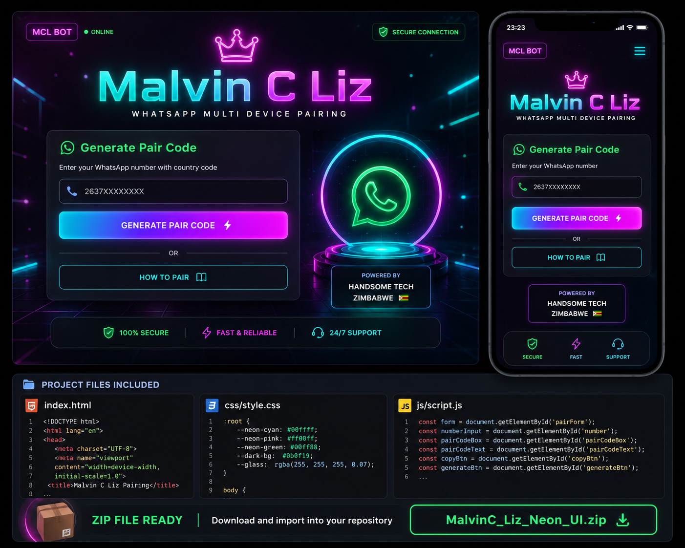

# Malvin C Leo WhatsApp Multi-Device Bot

Powered by Handsome Tech ZW 🇿🇼

## Introduction

This is a multi-device WhatsApp bot designed to provide various functionalities through simple commands. The bot is named Malvin C Leo and uses a `.` prefix for all commands. It is powered by Baileys for robust multi-device support.

## Features

- Multi-device support (Baileys)
- **Pairing Code** system for easy connection
- Extensive command set (387 tangible commands)
- Chatbot capabilities

## How to Pair Your Bot

1.  **Start the bot:** Run `npm start` or `node index.js` in your terminal.
2.  **Access the pairing page:** Open your web browser and navigate to `http://localhost:3000` (or the appropriate URL if deployed). This page will prompt you to enter your phone number.
3.  **Enter your phone number:** On the webpage, enter your WhatsApp phone number (e.g., `263xxxxxxxxxx`).
4.  **Get Pairing Code:** The bot running in your terminal will display a **pairing code**.
5.  **Link with WhatsApp:**
    *   Open WhatsApp on your phone.
    *   Go to `Settings` (or `Linked Devices` on some versions).
    *   Select `Linked Devices`.
    *   Tap `Link a Device`.
    *   Choose `Link with phone number` (instead of QR code).
    *   Enter the **pairing code** displayed in your terminal.
6.  **Bot is ready:** Once linked, the bot will connect and be ready to receive commands.

## Commands

All commands start with the prefix `.`. 

**Menu Image:**

## Deployment

This bot is designed to be deployable on platforms like Railway, Render, Replit, and others. Ensure you have Node.js and npm installed.

### Local Setup

1.  Clone this repository.
2.  Run `npm install` to install dependencies.
3.  Run `npm start` to start the bot.

### Environment Variables

- `PORT`: (Optional) The port for the web server (defaults to 3000).

## Contributing

Feel free to contribute to the development of Malvin C Leo Bot. Fork the repository, make your changes, and submit a pull request.

## License

This project is licensed under the MIT License - see the LICENSE file for details (if any) details.
